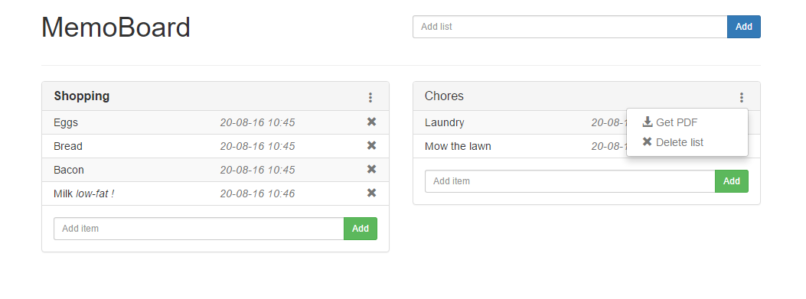

# MemoBoard

Single page web app to keep track of various things, like shopping lists, to dos, ... The backend is written in python
using flask and flask-restful. The front end is coded around the react and redux js libraries. Ideal to run on a hobby webserver 
(e.g. raspberry pi).

## Installation

Installation instruction for deployment on a linux system. 

Clone the repository

    git clone https://github.com/sepro/MemoBoard.git MemoBoard
    
Set up a virtual environment
    
    cd MemoBoard
    python -m venv venv

Activate the environment and install packages (Windows)

    venv\\Scripts\\activate.bat
    pip install -r requirements.txt
   
Activate the environment and install packages

    source venv/bin/activate
    pip install -r requirements.txt
    
Configure MemoBoard

    vim config.py

Create the database and migration

    # create database
    flask createdb
    
**Note:** When running this through a webservice and using SQLite, make sure the user www-data has read/write access to the file.

Run tests and run app

    python run_tests.py
    
    flask run
    
Check the web how to configure the webserver of your choice (tested with uwsgi and nginx) to serve memoboard. In case
a sqlite database is used, make sure the file is readable and writeable by the webserver.

# Front-end development

Install all packages through npm 

    npm install

Test (using Mocha)

    npm test

Build ./memoboard/static/js/bundle.js using webpack

    npm run-script build

# Contribute to Memoboard

Everyone that wishes to contribute to this project is welcome to reach out. Especially developers with JSX and React
experience are invited so scrutinize and improve my code (this was my first project with that technology and there is
room for growth and improvement)

# Acknowledgements

This project makes use of several python packages and javascript libraries, without these development would have been much more complicated.
The favicon is from [http://www.freefavicon.com/]([http://www.freefavicon.com/).
